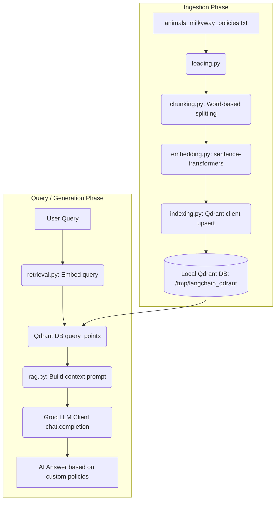

# 🌌 Basic RAG System

A Very Basic **Retrieval-Augmented Generation (RAG)** pipeline designed to ingest, chunk, embed, index, and query documents

This system uses:
- **Sentence-Transformers** (`all-MiniLM-L6-v2`) for generating local vector embeddings.
- **Qdrant** (file-based vector database) for storing and querying text embeddings.
- **Groq Cloud API** for fast inference using LLMs (e.g., Llama/Gemma models).
- **uv** for Python dependency management.

---

## 🏗️ Architecture Overview

The pipeline operates in two major phases: **Ingestion & Indexing** and **Query Retrieval & Generation (RAG)**.



---

## 📂 Project Structure

| File | Description |
| :--- | :--- |
| **`animals_milkyway_policies.txt`** | The raw document containing policies, and some text related to animals, and Milkyway galaxy. |
| **`loading.py`** | Basic document loader that reads raw text files. |
| **`chunking.py`** | Implements clean line preprocessing and word-level text chunking (default 50 words per chunk). |
| **`embedding.py`** | Loads the `all-MiniLM-L6-v2` embedding model and encodes chunks into 384-dimensional dense vectors. |
| **`indexing.py`** | Recreates/initializes a collection in Qdrant and upserts text chunks with vectors and payload. |
| **`verify_indexing.py`** | Quick helper script to check the status of the local Qdrant collection and scroll/view indexed points. |
| **`retrieval.py`** | Performs semantic search/cosine similarity query against Qdrant collection and returns top-K results. |
| **`rag.py`** | Builds system/user prompts, fetches context chunks via `retrieval.py`, and streams/sends them to the Groq API. |
| **`pyproject.toml`** | Standard metadata and dependencies list managed by `uv`. |

---

## 🛠️ Setup & Installation

### Prerequisites
- Python `3.13` or higher.
- [uv](https://github.com/astral-sh/uv) package manager installed.
- A **Groq API Key** (Get one at [console.groq.com](https://console.groq.com)).

### 1. Clone & Initialize Environment
```bash
# Navigate to the project directory
cd Basic_RAG_proj

# Install dependencies and sync virtualenv
uv sync
```

### 2. Environment Variables
Create a `.env` file in the root directory:
```env
GROQ_API_KEY=your-groq-api-key-here
GROQ_MODEL=llama3-8b-8192
```

---

## 🚀 How to Run

### Step 1: Document Indexing
To chunk the documents, embed them locally, and upsert them to Qdrant:
```bash
uv run indexing.py
```

### Step 2: Verify Index Status (Optional)
Check that Qdrant database collection has indexed the chunks correctly:
```bash
uv run verify_indexing.py
```

### Step 3: Run the RAG pipeline
Ask a question about the documents, such as "Why is the sky blue?" or "What are some interesting facts about the Milky Way galaxy?".
```bash
uv run rag.py
```

---

## ⚙️ Configuration details

- **Chunk Size**: Configurable via `CHUNK_SIZE` in [chunking.py](default is `50` words).
- **Embedding Model**: Default is `all-MiniLM-L6-v2` (384 dimensions), configured in [embedding.py].
- **Database Path**: Stored locally at `/tmp/langchain_qdrant` as specified in [indexing.py].
- **Top K**: The number of retrieved document sources defaults to `3` in [retrieval.py] and `5` in [rag.py].
